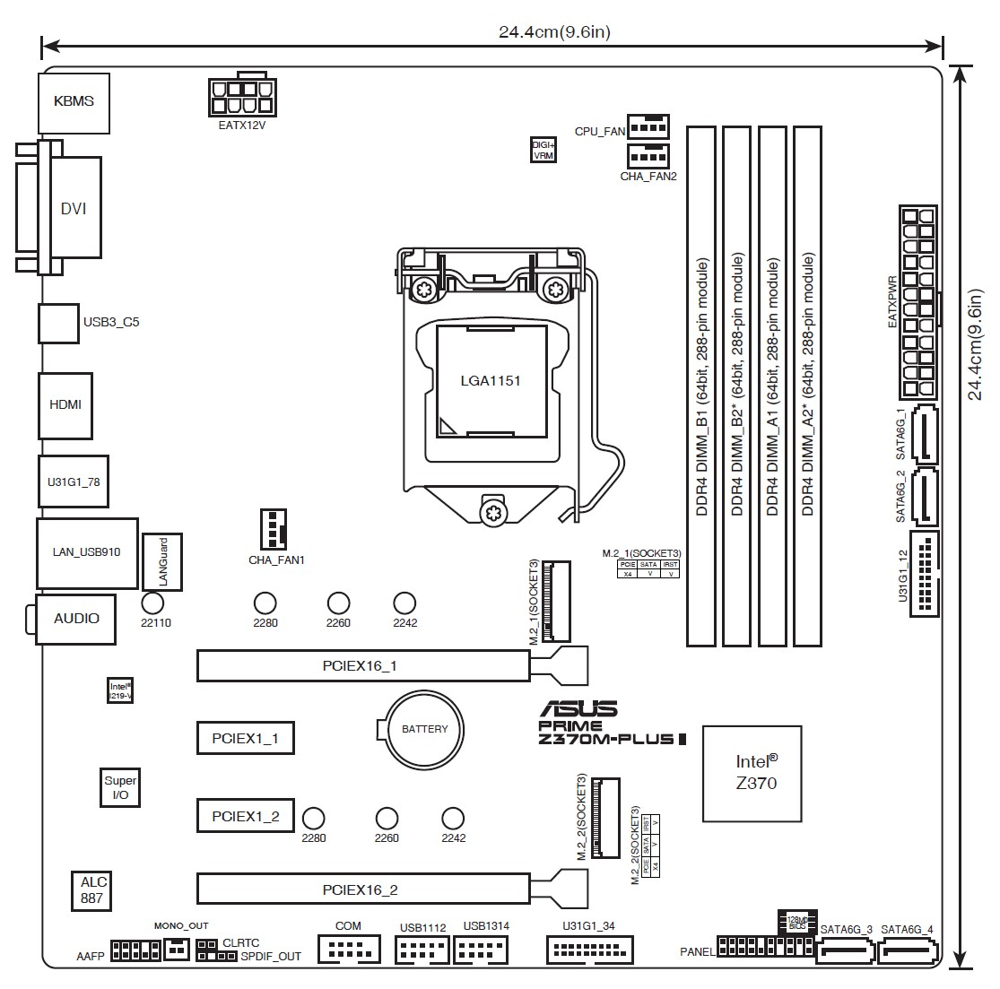

# Opencore-EFI-Z370M
`Opencore-0.9.9` EFI for Hackintosh `13-Ventura` install/boot.

# 主板接口图 Motherboard plugs graph

# 硬件 Hardware Specification

The total worth of this hackintosh is ￥2876 ($398 USD)

| Part | Model | Details |
| ----- | ----- | ----- | 
| 主板 Motherboard | 华硕 Asus Z370M Plus II | USED |
| CPU | Intel 8600K | OEM USED |
| iGPU | Intel UHD 630 | Integrated |
| GPU | AMD RX 5700XT Sapphire Nitro+ | 超白金OC USED |
| RAM | 丁凌存储 3200MHz DDR4 32G | 海力士Hynix颗粒 |
| SSD | WD SN550 HBM 1T | Old controller |
| SSD | GUDGA 128G | for Win11 USED |
| 电源 Power | 玄武550 | Rated 600W |
| 网卡 NetAdapter | BCM94360CD | USED |

Chinese and English introductions are provided below:

# 中文文档 Readme
### 如果有5700xt独显：
- 安装U盘中，可以使用`EFI-installer`，其中已经匹配好了华硕Z370M-Plus-II主板的USB端口。
    - USB3 gen1 使用了主板上的`U31G1_34`，另一个空置未使用。 
    - 机箱USB口接的`USB1314`
- 安装过程屏幕可直接插5700XT。
- 安装好后，可以使用`EFI-hless-r24-ag5500xt-ss5700-RTC-acpi-wake` 替代系统EFI，实测48小时工作无故障。
- 请删除EFI文件夹的后缀名，只保留`EFI`，本仓库的后缀只为方便标注辨别。

### 如果没有GPU，仅有CPU核显UHD630
- 安装好后，可以使用`EFI-UHD-working`代替系统EFI，注意文件夹应重命名为`EFI`再使用。
- 实测24小时工作无故障。
- UHD630可以带动4k屏，如果想要4K60FPS，需要主板的HDMI/DP接口支持。主要瓶颈是主板接口规格。

### 目前的体验
- [x] Apple ID 登录正常
- [x] iCloud 全部服务正常，AppStore正常。
- [x] AriDrop 正常
- [x] 西部数据SSD完全正常
- [x] 锁屏解锁体验正常
- [x] 开关机流程顺畅，工作正常。无`safe-mode`警告。
- [x] Chrome浏览器正常，看视频正常，必须关闭其硬件加速。Safari浏览器不正常，鉴于我用Chrome，无所谓。
- [x] USB口均正常。
- [x] 蓝牙连音响、连键盘正常
- [x] 蓝牙/有线连妙控板2正常
- [x] 锁屏熄屏正常。主机不睡眠，锁屏后自动休停屏幕，体验正常。
- [x] 速度完爆一切macbook pro，同时开20个sketch大文件画图，完全流畅毫无卡顿。
- [x] 自购SSD太划算了，Nvme 1TB才三百来块，速度快的飞起，反观Apple，无语。
- [ ] 深度睡眠hibernate不正常，已禁止任何睡眠，之后一切正常。
- [ ] 浅睡唤醒Darkwake不正常，已禁止任何睡眠，之后一切正常。

### 详细说明
- 关于BIOS
    - 关闭vt-d
    - 关闭usb s5唤醒
    - 关闭快速启动
    - 关闭安全启动
    - 关闭串口
    - 关闭网络唤醒等各类唤醒
    - 启动类型=其他操作系统
    - 关闭 Resizable Bar
    - 开启大于4G寻址
    - 北桥-开启核显
    - 北桥-核显分配内存=1024MB
    - 北桥-首选显卡=自动
    - 开启内存XMP
    - 其他更细致的设定，请遵循[Opencore](https://dortania.github.io/OpenCore-Install-Guide/config.plist/coffee-lake.html#starting-point)针对Coffeelake-CPU的建议
- 关于USB安装盘
    - 使用了USB3盘，镜像加载速度明显提升。
    - 从mac上下载了Ventura的安装dmg，大小12GB，在mac下使用命令制作了完整系统的安装U盘
    - 尝试过Opencore推荐的macrecovery小镜像，只有673MB，但是完整系统需要联网下载，网速越来越慢，要至少48小时，中国区果友可以直接放弃这种在线安装思路。
- 关于主板USB口
    - 使用`USBToolBox.kext`,`UTBMap.kext`映射端口
    - 如果你插的主板口不是我提到的`U31G1_34`和`USB1314`，则应该自行下载 `USBToolBox` 的程序工具，重新映射端口，并生成你自己的 `UTBMap.kext`，替换本仓库EFI中的 `UTBMap.kext`。

### 关于AMD 5700XT显卡的特别说明
- AMD RX 5000全系和部分6000系列显卡被报告有大量原厂故障缺陷 [1](https://forums.tomshardware.com/threads/rx-5700xt-green-screen-bad-gpu.3533926/) [2](https://community.amd.com/t5/drivers-software/rx-5700xt-green-screen-crashes/td-p/142073) [3](https://community.amd.com/t5/drivers-software/rx-5700xt-green-screen-crashes/td-p/142073) [4](https://forums.tomshardware.com/threads/5700xt-green-screen-crash.3669085/) [5](https://www.bilibili.com/read/cv15226963/) [6](https://tieba.baidu.com/p/7208773691) [7](https://www.rednn.com/digital/202004/19383.html) [8](https://blog.csdn.net/RellyChodorow/article/details/133490387) [9](https://tieba.baidu.com/p/8641758085)
- RX5000 系列显卡经常有绿屏死机、开浏览器卡死/绿屏死机的问题
- AMD显卡绿屏死机问题在全新白苹果/黑苹果/Win11/Win10/Win7下都有大量发生。
- AMD绿屏的原因：
    1. AMD驱动问题：较为多见，一些Win案例降级为早期驱动解决。一些Win案例安装了[AMD网吧专区](https://www.amd.com/zh-cn/gaming/icafe.html#drivers)的网吧驱动解决。一些Win案例彻底重装驱动解决。
    1. AMD驱动-Mac特定驱动问题：Mac的驱动适配臭名昭著，Vega风扇门事件就暴露出其糊弄的本性。Mac下调用AMD显卡的硬件编解码功能，经常会出问题，直接导致显卡宕机，绿屏死机。经我测试，Ventura黑苹果下，只要在Safari/Chrome浏览器中调用了5700XT的硬件解码，5秒内立刻绿屏死机，症状确定性极强，就是图像/视频硬件解码崩溃。通过关闭浏览器硬件解码，可直接避免AMD显卡硬件解码的诸多问题。
    1. 硬件设计问题：AMD显卡功耗稳定性口碑一直都很差，有大量案例报告AMD显卡瞬时功率会上下飘忽好几倍，电流拉取落差极大，取电特性和过山车一样极不稳定。一部分“AMD掉驱动”就和此现象有关,骤发高电流超过了电源荷载能力，导致显卡掉电reset，驱动识别不到了，其实本质是掉显卡，而不是掉驱动，一些案例通过购买超规格电源解决，比如200瓦的AMD显卡配750瓦金牌电源，有些案例从此就再也没出过异常。
    1. 制造商问题：AMD功耗稳定性设计较差的前提下，如果制造商的BIOS调教差/制造工艺不佳或散热不佳，高负荷下产生突发过温或电流脉冲，即会导致电子故障。一些案例通过刷低端BIOS解决，一些通过修改BIOS频率降频解决，一些通过在黑苹果中[仿冒为5700W](https://github.com/osx86-ijb/amd-radeon-rx-5700xt-macos-123-spoof-fix-workaround/blob/main/README.md)或[RX5500](https://dortania.github.io/Getting-Started-With-ACPI/Universal/spoof.html)解决，一些案例通过采用低端的[AGPM显卡供电配置文件](https://github.com/Pavo-IM/AGPMInjector)来解决。
    1. HDMI适配问题：AMD显卡对HDMI兼容缺陷是一个已知问题，AMD官方今年与HDMI协商共建2.1开源驱动，疑似是为了解决某些HDMI兼容问题，但遭到HDMI方面拒绝。很多案例报告AMD显卡就是在HDMI线上绿屏，换成DP线后再也没出现过。考虑到DP协议是完全开放免费的，可能AMD对其进行信号优化会更容易。
    1. 线材本身问题：很多案例报告HDMI换更高端HDMI，也能消除绿屏；也有个别案例报告DP出现绿屏，但换成HDMI却不绿屏了。本文认为最可能的解释是AMD对信号同步/失同的控制矫正机制做的并不好，在遇到电阻大、接口松、端阻不等、线过长、噪声错误等情况时不能正确reset，更换端阻统一、抗噪更强的高级线材确实能掩盖硬件容错差的问题。
    1. 常见二手显卡故障：显存虚焊，或核心虚焊，温度高时板材形变，导致触点断连，显卡信号立刻失常失序，从而绿屏/花屏/黑屏死机。一些案例送修加焊解决，寄修费用总共200~300元。如果是矿卡，在潮湿自然风冷环境下电容电阻都会锈蚀，某一天会直接断触，更换对应电阻电容、周边芯片解决，费用200元左右。
- 本人折腾Ventura+5700xt绿屏的关键经验结论：
    1. 首先Win11+HDMI，压力全过，长测全正常。显存覆盖全正常。
    1. MacOS Ventura原状态，系统操作全正常，一旦开浏览器，10秒内绿屏，100%复现，严重故障。
    1. 弃用Safari，改用Chrome，能坚持5分钟，绿屏。
    1. 关闭Chrome硬件加速：浏览器30分钟后绿屏。
    1. `-rad24`配合GPU电源管理`AGPM5500XT方案`，坚持1.5小时后绿屏。
    1. `-rad24`配合`AGPM5500XT`再配合`5700XT-SSDT`，坚持14小时，未绿屏，停测。
    1. `-rad24`+`AGPM5500XT`+`5700XT-SSDT`+`acpi-wake`,HDMI线，坚持50小时后，绿屏死机。
    1. 上述配置，改用DP线，坚持5小时，绿屏现象消失，变为黑屏，未关机，但也无反应。
    1. 关闭所有睡眠+使用显卡DP二号口，正在测试中，截至目前，已工作16小时。
    - [ ] 绿联DP线在路上，待测。
    - [ ] 修改显卡BIOS，限制频率，待测。
    - [ ] 备选版本 12-Monterey 已下载，待测。

- 关于5700xt的其他经验分享：
    1. Win11下AISuit自动超频8600K CPU，会导致Win崩溃+花屏+重启雪花屏+反复重启花屏。需重置BIOS+消除华硕超频设定，方能恢复正常。
    1. Win11下使用AMD Adrenalin，对5700XT降压，会导致Win11崩溃+雪花屏死机。DDU重装驱动恢复默认设置后正常。
    1. Win11下使用5700XT的备用2号BIOS，也降压，会导致Win11崩溃+绿屏死机。DDU+恢复1号BIOS后重回正常。
    1. 5700XT蓝宝石的两份BIOS完全相同，大小和MD5均完全相同，而且与[TechPowerup](https://www.techpowerup.com/vgabios/?architecture=AMD&manufacturer=Sapphire&model=RX+5700+XT&interface=&memType=&memSize=&since=)的网传5700XT官方BIOS也完全相同。即便这样，二号BIOS也会崩溃，而一号BIOS+Win11完全正常。

### config.plist 详细说明
TODO

### 重要提示与故障问题解答
- 强烈推荐，强烈推荐买一个单独的SSD，装一个windows，128G足够了，二手价格在36元左右，一个硬独立双系统windows几乎能帮你解决所有遇到的问题。可以说如果没有这份单独的128G+win11，我是无法在华硕z370m-plusII上安装配置成功的。
- 新手安装黑苹果时，一定会需要依赖黑苹果主机硬件信息，比如映射USB，调整CPU供电，调整显卡型号参数，调试核显，根据主板内的SSDT来解决bug等等，所以在黑苹果机上装一个windows，上述操作将变得非常非常轻松。
- 5700XT连屏幕，遭遇了显示器绿屏，全屏绿，崩溃死机
    - 我遇到了，解决了，全部方法分享如下：
    - 先验证显卡是否良好
        - 在windows下，显卡驱动全部默认设置，不要降频也不要超频。下载图吧工具箱，跑个甜甜圈。
        - 如果崩溃，请下载 DDU （[Display Driver Uninstaller](https://www.wagnardsoft.com/content/Download-Display-Driver-Uninstaller-DDU-18076)）彻底卸载AMD驱动。进安全模式请见[微软官方指导](https://support.microsoft.com/zh-cn/windows/%E5%9C%A8-windows-%E4%B8%AD%E4%BB%A5%E5%AE%89%E5%85%A8%E6%A8%A1%E5%BC%8F%E5%90%AF%E5%8A%A8%E7%94%B5%E8%84%91-92c27cff-db89-8644-1ce4-b3e5e56fe234) 重装驱动，不要动设置。再进正常系统，开甜甜圈压力测试看看。
    - 如果显卡在windows下也绿屏或花屏崩溃
        1. AMD驱动问题，可以下载老版本驱动，或者进AMD官网-网吧专区，下载网吧驱动，有网友报告问题解决。
        1. HDMI线材与协议问题，AMD显卡对HDMI兼容缺陷是一个已知问题，AMD官方今年与HDMI协商共建开源驱动，疑似是为了解决HDMI兼容问题，但遭到HDMI方面拒绝。
        1. 显卡显存虚焊，或显卡核心虚焊，寄修费用预估200~300。

# How to use: Readme!
### TODO